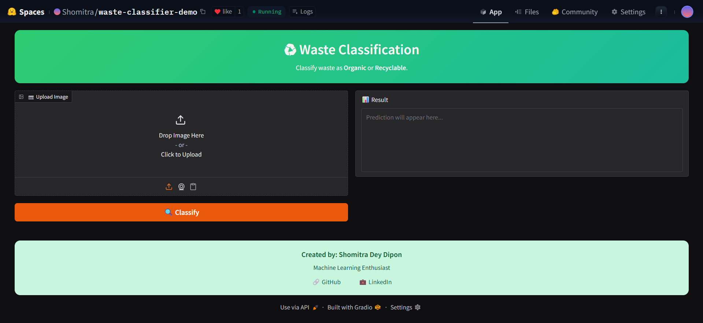
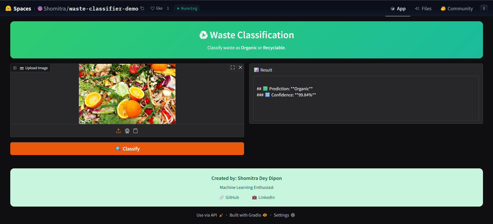
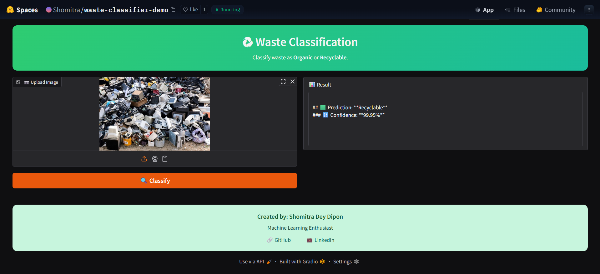

# Binary Waste Classification: Custom CNN vs Transfer Learning

**Best Model**: Custom CNN — **92% Test Accuracy**  
(outperforms MobileNetV2, ResNet50V2, EfficientNetB3)

## Dataset
- Source: [Mendeley Data](https://data.mendeley.com/datasets/n3gtgm9jxj/2) (DOI: 10.17632/n3gtgm9jxj.2)
- Classes: Organic (O) vs Recyclable (R)
- Total: ~25,077 images

## 🚀 Live Demo on Kaggle (No Local Setup – Takes 2 Minutes!)

**Video Tutorial**:  
→ [Watch Step-by-Step Live Testing on Kaggle](https://drive.google.com/file/d/1cpObNzgsrWvZoNQWnMGSLKlTAuijgHB0/view?usp=drive_link)

### Easy Text Guide – Run the Model Yourself on Kaggle

1. Go to [kaggle.com](https://www.kaggle.com) → New Notebook  
2. Settings → Accelerator → **GPU T4 x2** (turn ON)  
3. Add Data → Search **“waste classification data techsash”** → Add  
4. Download the model (choose any one):  
   - [.keras (~220 MB)](https://drive.google.com/uc?export=download&id=1eTrUXoKi-WHL1i3qkC7TGmG-vL98p3rR)  
   - [.h5 (~220 MB)](https://drive.google.com/uc?export=download&id=1vTbM7_js01g_3hDPoV9moEBo4nY6ECU5)  
5. Upload the downloaded model file to your notebook (drag & drop)  
6. Copy-paste and run the code from `inference.py` (already in this repo)  
7. Change the model path to your uploaded file (e.g., `/kaggle/working/custom_cnn_best.keras`)  
8. Pick any image from `/kaggle/input/waste-classification-data/DATASET/TEST/O/` or `/R/` and paste its path  
9. Run → Instant prediction with confidence!

**That’s it — live testing in seconds!**

## Or test the model deployed on Hugging Face 🤗
→ Follow this link [Hugging Face](https://huggingface.co/spaces/Shomitra/waste-classifier-demo)

## Sample Interface & Predictions

### 🔹 1. Web Interface (Hugging Face App)

### 🔹 2. Organic Waste Classification Sample

### 🔹 3. Recyclable Waste Classification Sample

**Key Finding**: A simple custom CNN trained from scratch beats large transfer-learning models on noisy real-world waste images!

Happy classifying! ♻️
